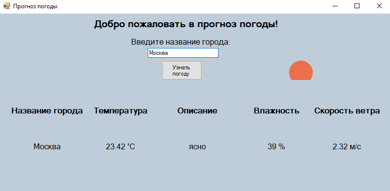
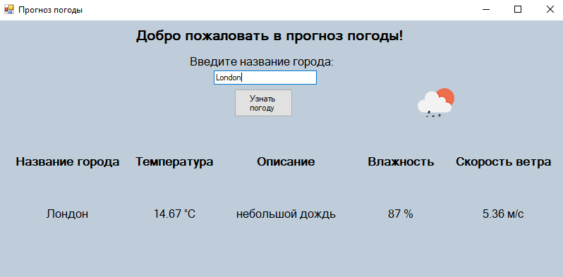

# WeatherForecastApp (Win Forms)

Windows Forms приложение для просмотра текущей погоды в городах по всему миру, с использованием `OpenWeatherMap API`.

## Быстрый старт 🚀

### Предварительные требования ⚙️
- ОС: Windows 10/11
- Платформа: .NET 6.0+
- IDE: Visual Studio 2022
- API Key: ключ от `OpenWeatherMap`

### Установка и запуск 🔧
1. Скачайте архив или клонируйте репозиторий(если установлен git)
   ```bash
   git clone https://github.com/BanCoder/WeatherForecast.git
   cd WeatherForecast
   ```

2. Получите API ключ
   - Зарегистрируйтесь на [OpenWeatherMap](https://openweathermap.org/current)
   - Подтвердите email и получите API ключ
3. Настройте API ключ в приложении
   - Добавьте API ключ в конфигурацию `appsettings.json` *(Путь: bin\Debug)*
      
      ***Пример:***

      ```json
      {
         "APISettings": {
            "apiKey": "ВАШ_КЛЮЧ", 
            "baseUrl": "https://api.openweathermap.org/data/2.5/weather"
         }
      }
      ```
4. Запустите программу в Visual Studio 2022
   - Откройте решение `WeatherApp.sln`
   - Нажмите на `F5` или на кнопку `Пуск`
   - Перейдите в папку `bin\Debug` и запустите .exe файл
   
### Как пользоваться? 🕹️
- Введите город - на английском или русском языке
  
  ***Пример:***
  `Москва` или `Moscow`
- Нажмите кнопку - "Узнать погоду"
- Получите данные - актуальная информация о погоде
    - Название города
    - Описание погоды (ясно, облачно, дождь и т.д.)
    - Влажность воздуха
    - Скорость ветра
    - Иконка текущей погоды

### Важно ⚠️
- Бесплатный API ключ имеет лимит: 60 запросов в минуту
- Некоторые города могут не находиться (проверьте название)
- Для работы требуется интернет-соединение

### Скриншоты 🖼️



### Особенности ✅
- Актуальные данные - реальная погода через API
- Визуальные иконки - графическое отображение погоды
- Подробная информация - все основные метеопараметры
- Русский язык - локализованные описания погоды
- Обработка ошибок - уведомления о проблемах

### Архитектура 🛠️
#### Технологический стек 💻
- Windows Forms - пользовательский интерфейс
- HTTPClient - выполнение API-запросов
- Newtonsoft.Json - десериализация JSON
- OpenWeatherMap API - источник данных

#### Основные компоненты 📃
- WeatherForecast - главная форма
- Requester - класс для API-запросов
- WeatherData - модель данных о погоде

